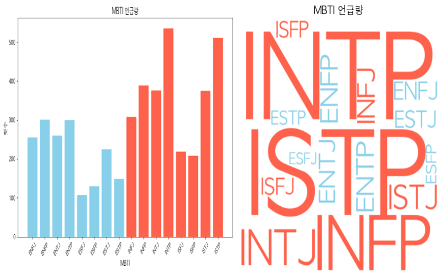
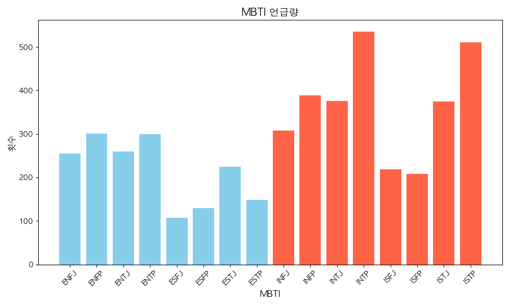
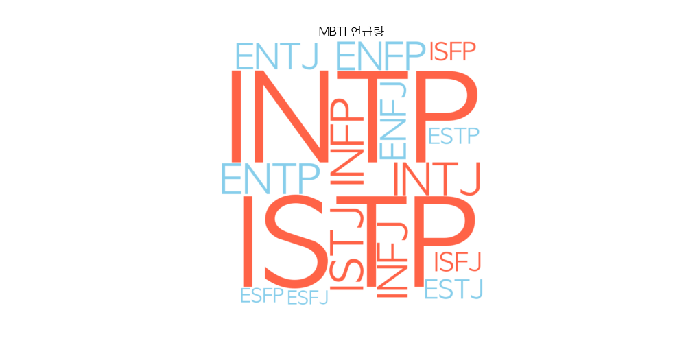
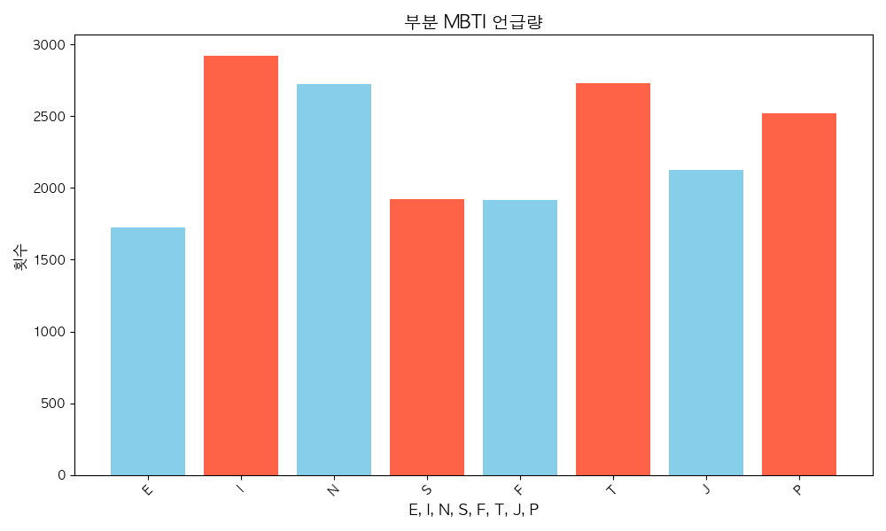

# 파이비즈 (PyViz)

## 요약

> 웹 커뮤니티 MBTI 언급량 크롤링, 데이터 분석·시각화



## 상세

4번째 PJT

### 0. 목차

1. 소개
2. 기술 스택
3. 느낀 점
4. 기능 (페이지 구성)
5. 아쉬웠던 부분
6. 앞으로 학습할 것들, 나아갈 방향
7. 어려웠던 부분, 해결한 과정

## 1. 소개

**파이비즈 (PyViz)**

- `Selenium`과 `Matplotlib`, `WordCloud`를 이용한 웹 크롤링, 데이터 시각화 프로젝트
- Blind의 [성격유형](https://www.teamblind.com/kr/topics/%EC%84%B1%EA%B2%A9%EC%9C%A0%ED%98%95) 게시판을 크롤링해 게시글 제목, 내용을 저장
- 어떤 유형의 MBTI가 언급이 많이 되었는지 분석하고 시각화
- 16개의 MBTI 각각 얼마나 언급되었는지 그래프로 시각화
- `E`/`I`, `N`/`S`, `F`/`T`, `J`/`P` 별로 얼마나 언급되었는지 시각화
- 워드클라우드로도 시각화

작업 기간

- 2024/10, 1주

인력 구성

- 1인

## 2. 기술 스택


## 3. 느낀 점

- Python이 사용하기에 상당히 편했다. JavaScript와 비슷한데 모듈 분할이나 문자열 처리하는 부분이 더 편했다
- 크롤링을 해서 데이터를 수집하고, 그 데이터를 분석하는 것이 재미있었다
- 코드를 작성하고, 기능이 추가되고 보완되면서 점점 `main.py`의 코드가 많아져서 관리하기 힘들었는데, `controllers` 모듈로 분할하니까 관리하기도 좋고 한 눈에 파악하기도 좋았다
- 크롤링을 할 때 너무 빠른 시간에 자주 하면 안 된다는 것을 깨달았다
- 데이터 시각화를 하니 그냥 CSV 파일이나 콘솔에 출력하는 것보다 분류한 데이터에 대한 이해가 쉬웠고 파악하기도 좋았다

## 4. 기능

### Python 가상환경 구동

```bash
python -m venv myvenv
source ./myvenv/bin/activate
pip install selenium
pip install bs4
pip install requests
```

### 구성

1. `main.py`
2. `selenium_controller.py`
   - Selenium으로 크롤링
3. `mbti_controller.py`
   - 크롤링한 데이터에서 MBTI 데이터를 추출
4. `plot_controller.py`
   - MBTI 데이터로 그래프 생성
5. `file_controller.py`
   - 크롤링한 데이터를 파일로 저장

시연 영상

- `assets` 폴더에 위치

### MBTI 그래프

MBTI별 언급량



MBTI별 언급량 워드 클라우드



MBTI 세부 항목별 언급량



번외, 구내식당 게시글 단어 빈도 워드 클라우드


## 5. 아쉬웠던 부분

- 게시판에 글이 많을 줄 알았는데, 약 4000개 정도로 생각보다는 많지 않았다
- 원래 처음에는 구내식당 인스타그램을 크롤링해서, 게시글에 쓰인 메뉴 소개를 받고, 이것들을 모아 ChatGPT API와 연결해 음식 메뉴를 뽑아달라고 하고(KoNLPy로는 명사만 추출 가능) 해당 음식이 나오는 빈도 수를 시각화하고 싶었다
- 게시글을 전부 보기 위해서는 로그인이 필요했는데, 너무 자주 해서인지 계정이 막혔다
- 그래서 MBTI 프로젝트로 전환했다..
- 같은 실수를 반복하지 않기 위해, 무작위 수를 넣어 크롤링 시간을 조절하는 것으로 보완했다

## 6. 앞으로 학습할 것들 나아갈 방향

- Node.js로도 크롤링을 진행해보고 싶다
- 좀 더 범용적으로 된 자동화 프로그램을 데스크탑 앱으로 만들고 다른 사람들에게 제공하고 싶다

## 7. 어려웠던 부분, 해결한 과정

### Python 가상환경

- 가상환경을 따로 만드는 것이 더 좋았다. 굳이 전역으로 설치하지 않아서 관리하기 쉬웠다

### KoNLPy

- `KoNLPy` 라이브러리를 사용해 한글 명사를 가져오려고 했다
- 라이브러리가 동작하지 않아 확인해보니, Java를 설치해야 했다

### Matplotlib

- 한글이 깨지는 문제가 생겨 한글 폰트를 지정해 해결했다

### Selenium

- 드라이버 설치 문제가 있었다

### 데이터 분석

- 한글로 쓰인 MBTI가 많았다
- Python 딕셔너리로 일일이 지정해서, 해당 한글 MBTI가 있으면, 영어 MBTI로 변환해서 저장했다

### 파일 분할

- 코드가 너무 길어져서 기능별로 분류한 후 모듈로 나눴다
- 크롤링 관련, 데이터 분석 관련, 그래프 출력 관련, 파일 입출력 관련으로 나누었다
- 보기도 쉽고 이해도 잘 됐다
